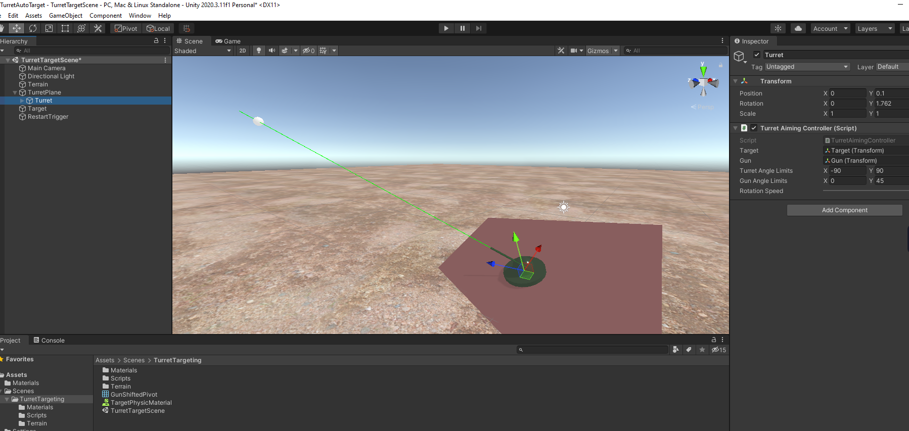

## Turret Aiming system

### Demo

Scene name: TurretTargetScene

Demo: Turret located on arbitrary oriented platform aimed for target.

Scripts
* CameraController - lookAt helper camera script
* ChaoticTargetController - controls Target rigidbody/respawn
* TurretAimingController - aiming controller for turret

_Note: build on URP_

### Screenshot

